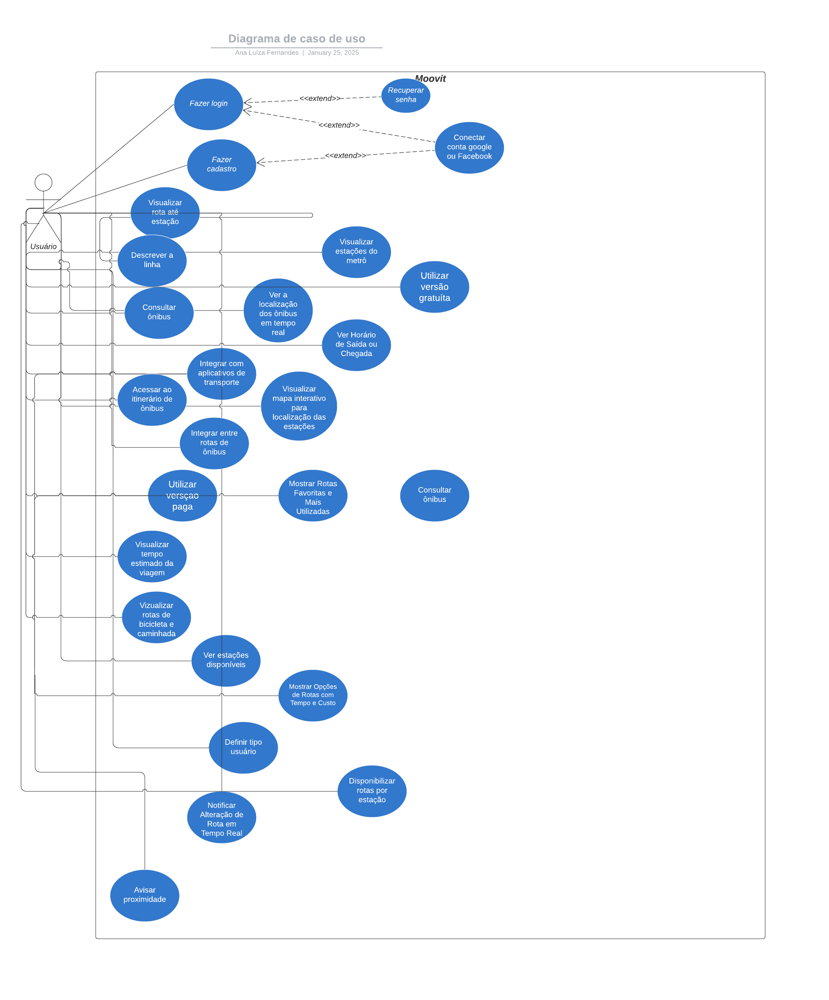

# Diagrama de caso de uso

## Definição:
Um diagrama de caso de uso é uma representação visual que descreve as interações entre os atores (usuários ou sistemas externos) e o sistema em análise, destacando as funcionalidades que ele oferece para alcançar os objetivos dos atores. Ele é amplamente utilizado na modelagem de sistemas com a UML (Unified Modeling Language), especialmente durante a fase de análise de requisitos.

## Histórico de Versões

| Versão | Data       | Alterações Principais              | Autor                        |
| ------ | ---------- |------------------------------------| ---------------------------- |
| 1.0    | 23/02/2025 | Criação do diagrama de caso de uso | [Ana Luíza](https://github.com/analufernanndess) |

    