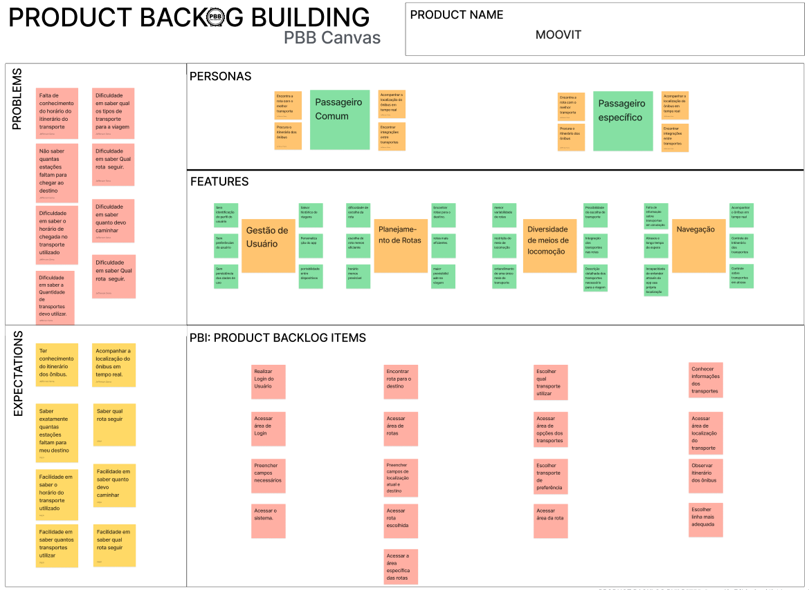

## Product Backlog Building - PBB

O Product Backlog Building (PBB) é uma técnica colaborativa que combina práticas de Design Thinking e Scrum para criar um backlog estruturado de funcionalidades para um produto. Criada em 2016 por Fábio Aguiar, a técnica tem como objetivo alinhar as equipes de desenvolvimento, negócios e design, promovendo uma visão clara das necessidades dos usuários e priorizando entregas que gerem maior valor ao negócio.

### Canvas PBB

## Histórico de Versões

| Versão | Data       | Alterações Principais | Autor                                                 |
| ------ |------------|-----------------------|-------------------------------------------------------|
| 1.0    | 23/01/2025 | Criação do PBB        | [Cayo alencar](https://github.com/Cayoalencar) e [Jefferson Sena](https://github.com/JeffersonSenaa) |
