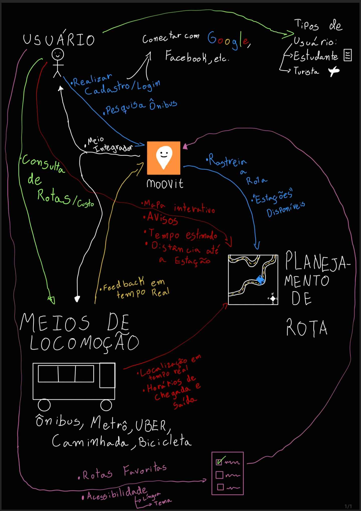

# Elicitação de Requisitos

## Definição
A elicitação de requisitos é a etapa inicial e essencial no desenvolvimento do  produto. Este processo tem como objetivo identificar e documentar as necessidades, expectativas e restrições de todas as partes interessadas. A rastreabilidade começa a partir do registro inicial desses requisitos, garantindo que cada funcionalidade implementada esteja alinhada com os objetivos do projeto. Foi realizado um Brainstorm para explorar ideias e possíveis funcionalidades do aplicativo seguido de um Rich Picture para refinamento dos requisitos e fluxos de execução das atividades 

## Rich Picture

O Rich Picture é uma ferramenta visual utilizada para representar, de maneira criativa e abrangente, o contexto do sistema e seus elementos principais. Ele permite uma visão holística do problema, ilustrando:

- Os atores envolvidos e suas interações.
- Processos-chave, fluxos de informação e recursos utilizados.

Essa técnica foi usada no levantamento e refinamento de requisitos para garantir um entendimento compartilhado entre as partes interessadas. A simplicidade e flexibilidade do Rich Picture permitem incluir elementos de forma livre, adaptando-se às necessidades específicas do projeto.

## Brainstorm
O brainstorm é uma técnica colaborativa utilizada para gerar ideias, identificar soluções ou explorar novas possibilidades para um projeto ou problema. Ele reúne um grupo de pessoas com diferentes perspectivas e incentiva a livre expressão de ideias, sem julgamentos ou críticas iniciais. O objetivo é estimular a criatividade e encontrar abordagens inovadoras.

### Video do Desenvolvimento do Brainstorm
O Brainstorm foi desenvolvido por todo grupo, mas por motivos técnicos o audio não foi carregado. Segue o vídeo:

<iframe width="560" height="315" src="https://www.youtube.com/embed/wmLmOpy-0oo?si=IS43GFiPn0ToGXbC" title="YouTube video player" frameborder="0" allow="accelerometer; autoplay; clipboard-write; encrypted-media; gyroscope; picture-in-picture; web-share" referrerpolicy="strict-origin-when-cross-origin" allowfullscreen></iframe> 

## Histórico de Versões

| Versão | Data       | Alterações Principais   | Autor                                    |
| ------ |------------|-------------------------|------------------------------------------|
| 1.0    | 23/01/2025 | Criação do rich-picture | [Bernardo](https://github.com/bermardoo) |