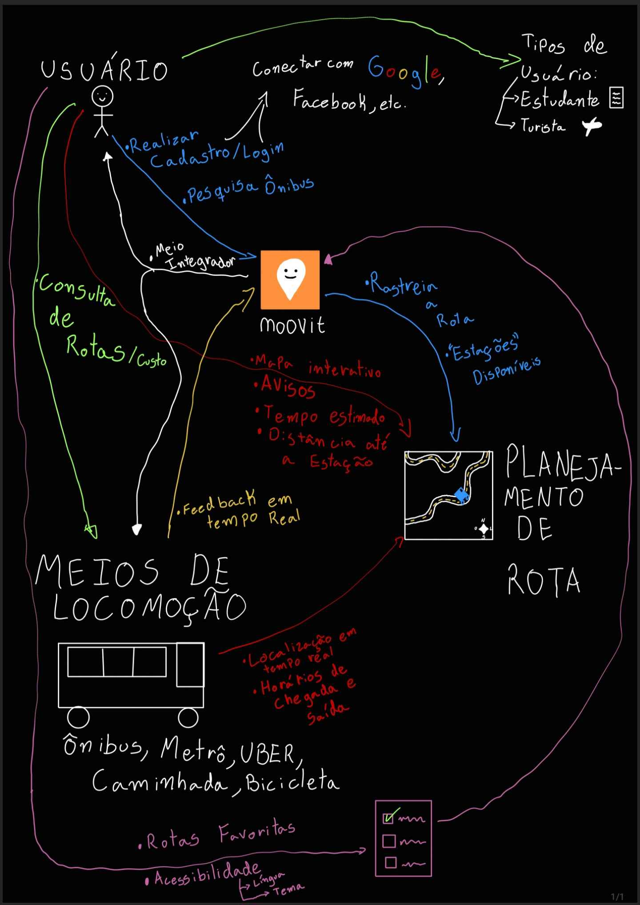

# Elicitação de Requisitos

## Definição
A elicitação de requisitos é a etapa inicial e essencial no desenvolvimento do  produto. Este processo tem como objetivo identificar e documentar as necessidades, expectativas e restrições de todas as partes interessadas. A rastreabilidade começa a partir do registro inicial desses requisitos, garantindo que cada funcionalidade implementada esteja alinhada com os objetivos do projeto. Foi realizado um Brainstorm para explorar ideias e possíveis funcionalidades do aplicativo seguido de um Rich Picture e Diagrama de Ishikawa para refinamento dos requisitos e fluxos de execução das atividades 

## Rich Picture

O Rich Picture é uma ferramenta visual utilizada para representar, de maneira criativa e abrangente, o contexto do sistema e seus elementos principais. Ele permite uma visão holística do problema, ilustrando:

- Os atores envolvidos e suas interações.
- Processos-chave, fluxos de informação e recursos utilizados.
- Problemas identificados e suas possíveis causas.

Essa técnica foi usada no levantamento e refinamento de requisitos para garantir um entendimento compartilhado entre as partes interessadas. A simplicidade e flexibilidade do Rich Picture permitem incluir elementos de forma livre, adaptando-se às necessidades específicas do projeto.

## Diagrama de Ishikawa
O Diagrama de Ishikawa, também conhecido como Diagrama de Causa e Efeito, é uma ferramenta de análise utilizada para identificar e organizar as possíveis causas de um problema. Essa técnica foi aplicada durante a elicitação de requisitos para identificar a raiz de desafios apresentados pelas partes interessadas.

Essa abordagem sistemática auxiliou na priorização de requisitos, focando na resolução de problemas críticos identificados durante a análise.

## Histórico de Versões

| Versão | Data       | Alterações Principais                                          | Autor                        |
| ------ | ---------- | -------------------------------------------------------------- | ---------------------------- |
| 1.0    | 23/02/2025 | Criação do Rich Picture e Diagrama de Ishikawa                    | [Jefferson](https://github.com/JeffersonSenaa) e [Bernardo](https://github.com/bermardoo) |
