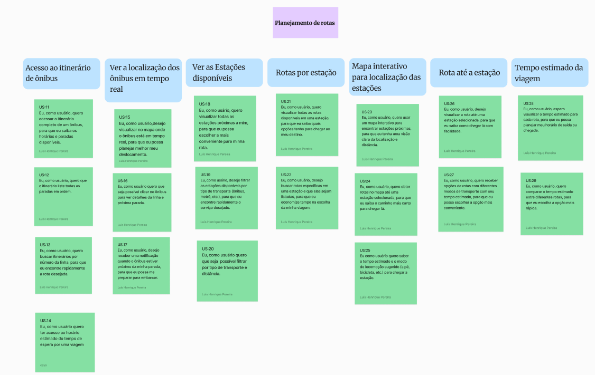
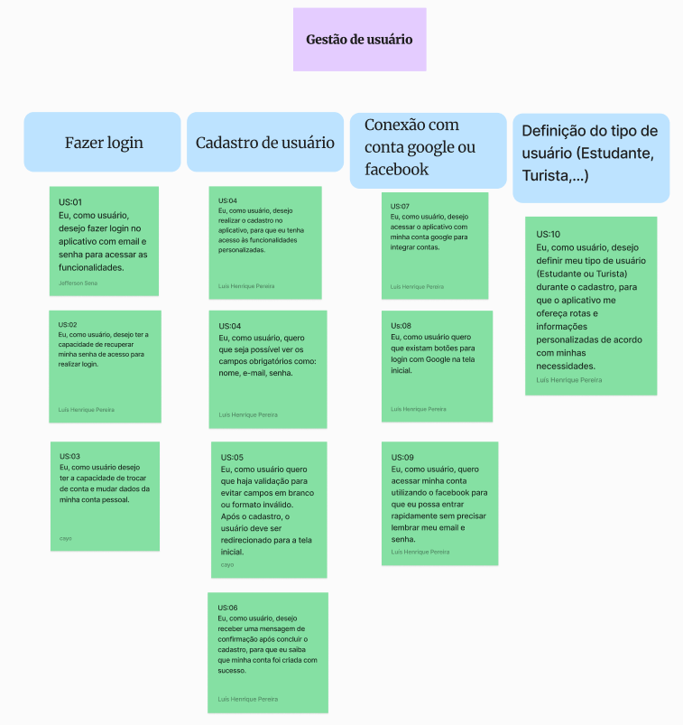
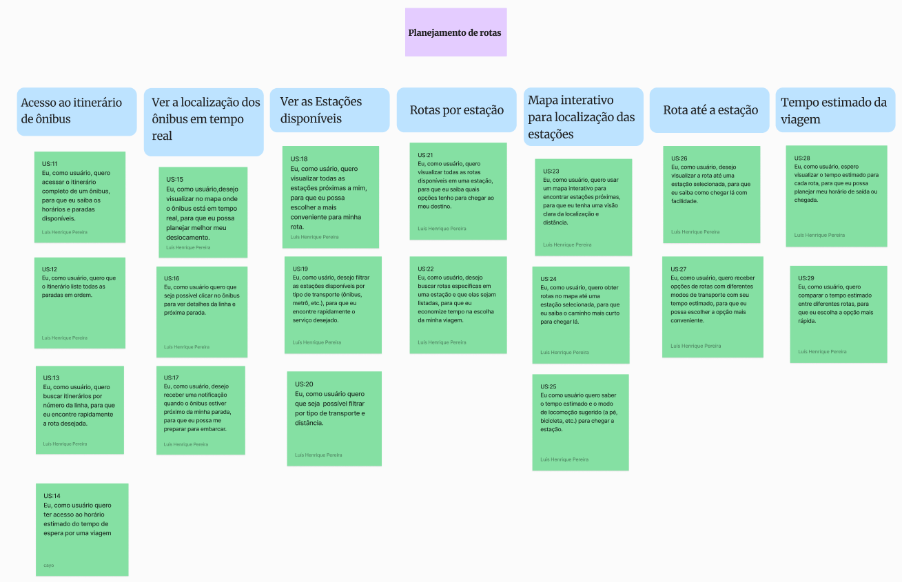
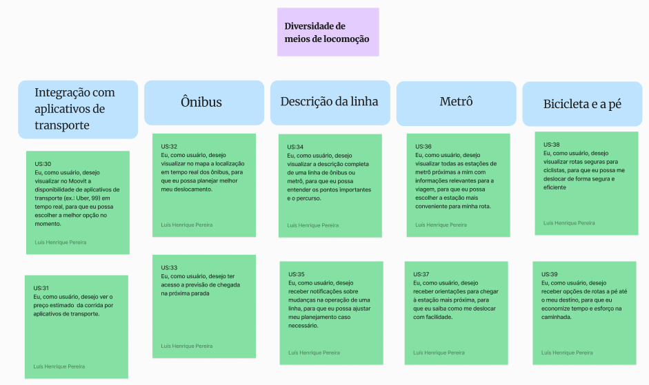
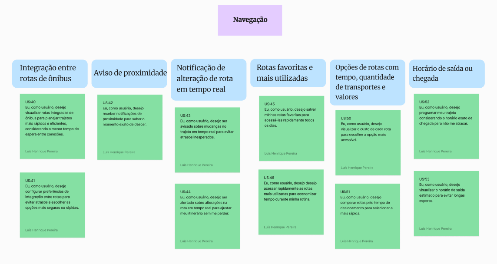
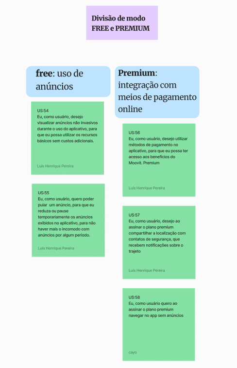

# Modelagem

## Diagramas no Figma

<iframe style="border: 1px solid rgba(0, 0, 0, 0.1);" width="800" height="450" src="https://embed.figma.com/board/wx0lUOe7CX6C7ulND8pgb9/Untitled?node-id=0-1&embed-host=share" allowfullscreen></iframe>

## User Story Map
Um User Story Map é uma ferramenta visual usada para planejar e organizar as funcionalidades de um produto ou sistema do ponto de vista do usuário. Ele ajuda equipes a compreenderem a experiência do usuário ao interagir com o produto, permitindo que as funcionalidades sejam priorizadas e alinhadas às metas de negócio. 

### USM - Épicos

## Histórico de Versões

| Versão | Data       | Alterações Principais     | Autor                                                                                       |
| ------ |------------|---------------------------|---------------------------------------------------------------------------------------------|
| 1.0    | 22/01/2025 | Criação do user story map | [Cayo Alencar](https://github.com/Cayoalencar) e [Luis](https://github.com/Luis-Henrique05) |
